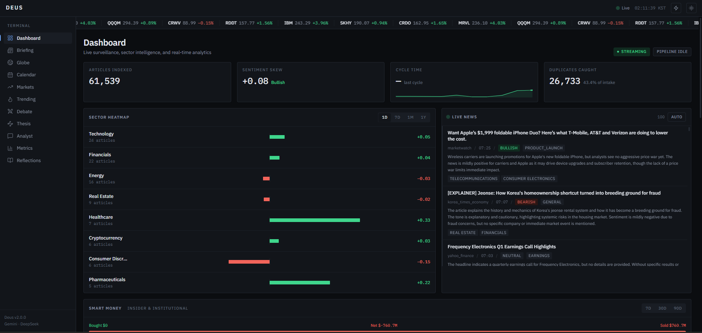
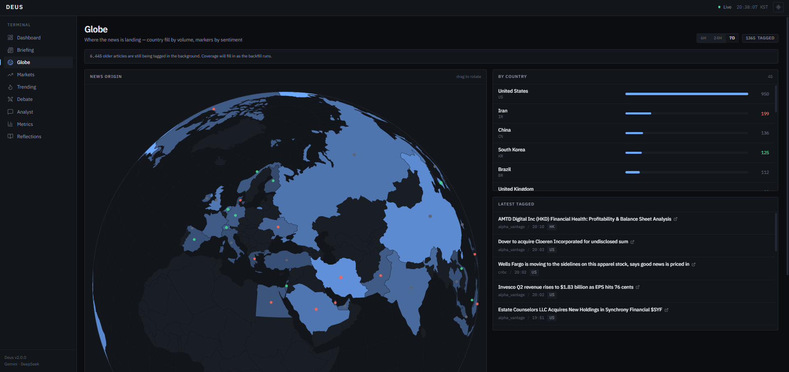
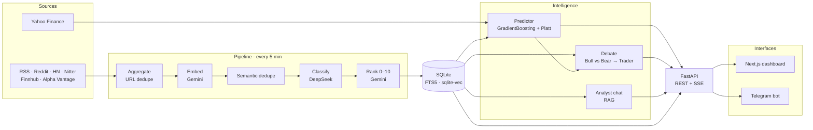

# Deus

Self-hosted AI financial news terminal. Ingests market news from RSS, Reddit, Hacker News, Nitter, Finnhub and Alpha Vantage; classifies and ranks it with DeepSeek and Gemini; trains per-ticker gradient boosting models to predict price direction; and serves everything through a Next.js dashboard and a Telegram bot.

<p align="center">
  
</p>

<p align="center">
  
</p>

## Features

- **News ingestion** — 6 source types fetched concurrently, deduplicated by URL and by embedding cosine similarity
- **Dual-LLM pipeline** — DeepSeek classifies event type, sentiment, urgency and tickers; Gemini scores importance 0–10 and pushes high-impact stories to Telegram
- **ML prediction** — per-ticker `GradientBoostingClassifier` with Platt scaling, 23 features (sentiment, technicals, market regime), 5-fold walk-forward CV
- **Multi-agent debate** — Bull and Bear researchers argue over two LangGraph rounds, synthesized into a Buy/Sell/Hold call by a trader agent
- **RAG analyst chat** — vector search over classified news with shallow/complex routing and token-by-token streaming
- **Market intelligence** — sector rotation, IPO tracking, earnings calendar, macro themes, trend scenarios, ≥5% price-swing alerts
- **Runs on a phone** — the static frontend export is served by FastAPI, so a Termux install needs no Node process at runtime

## Architecture



Work is split across two providers to keep cost down on the high-volume path:

| Task | Model |
|------|-------|
| Classification (~100s of articles/day) | `deepseek-v4-flash` |
| Bull/Bear debate | `deepseek-v4-pro` |
| Ranking | `gemini-3.1-flash-lite` |
| Chat and trader synthesis | `gemini-3-flash-preview` |
| Embeddings (3072-dim) | `gemini-embedding-001` |

Background jobs run on APScheduler: the ETL cycle every 5 minutes, market scanning every 10, sector analysis every 15, daily predictions and resolution, and weekly model retraining.

## Quick start

Requires Python 3.11+, Node 18+, and API keys for [Gemini](https://aistudio.google.com/apikey), [DeepSeek](https://platform.deepseek.com/api_keys) and [Telegram](https://t.me/BotFather).

```bash
git clone https://github.com/c0vo/Deus.git
cd Deus

python -m venv venv
venv\Scripts\activate          # macOS/Linux: source venv/bin/activate
pip install -r requirements.txt

cp .env.example .env           # add your API keys

python main.py                 # API on :8000, bot polling, scheduler running
```

Frontend:

```bash
cd frontend
npm install
npm run dev                    # :3000, proxies /api/* to :8000

npm run build:static           # or: export to frontend/out/, served by FastAPI on :8000
```

Deus binds to `0.0.0.0` with no authentication and open CORS, which is intended for a trusted LAN or tailnet. Set `API_HOST=127.0.0.1` or put it behind an authenticating reverse proxy before exposing it anywhere else — several endpoints spend money on LLM calls per request.

## Configuration

Everything lives in `.env`; see `.env.example` for the full list. Model names are config values, so they can be swapped without touching code.

```ini
GEMINI_API_KEY=
DEEPSEEK_API_KEY=
TELEGRAM_BOT_TOKEN=
TELEGRAM_CHAT_ID=
```

Optional: `FINNHUB_API_KEY`, `ALPHA_VANTAGE_API_KEY` and `TAVILY_API_KEY` add sources and web search, `REDDIT_SUBREDDITS` and `NITTER_ACCOUNTS` tune what gets scraped, and `SQLITE_VEC_PATH` points at a prebuilt `vec0` extension (needed on Termux).

## Telegram

`/markets` `/predict <TICKER>` `/trending` `/track` `/untrack` `/accuracy` `/briefing` `/sectors` `/ipos` `/events` `/themes` `/forecast` `/status` `/usage` `/help`

Plain messages are answered by the RAG chat orchestrator — e.g. *"Why did TSLA drop today?"*
