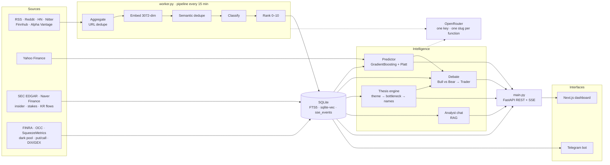

# Deus

Self-hosted AI financial news terminal. Ingests market news from RSS, Reddit, Hacker News, Nitter, Finnhub, WallStreetJournal, Twitter (In-Progress) and Alpha Vantage; classifies and ranks it through OpenRouter, with the model for each function set independently in `.env`; trains per-ticker gradient boosting models to predict price direction; and serves everything through a Next.js dashboard and a Telegram bot. Built to track US + Korean markets.

<p align="center">
  
</p>

<p align="center">
  
</p>

## Features

- **News ingestion** — 6 source types fetched concurrently, deduplicated by URL and by embedding cosine similarity
- **One model per function** — every call goes through OpenRouter on one key; 21 `MODEL_<FUNCTION>` settings in `.env` decide which model runs which step, provider included
- **Pipeline** — classification tags event type, sentiment, urgency and tickers; ranking scores importance 0–10 and pushes high-impact stories to Telegram
- **ML prediction** — per-ticker `GradientBoostingClassifier` with Platt scaling, 38 features (sentiment, technicals, market regime, disclosed positioning, off-exchange volume), 5-fold walk-forward CV
- **Smart money** — SEC Form 4 insider trades and 13D/13G >5% stakes for US tickers, daily institutional and foreign investor flows for Korean ones. Both feed the debate and the model, not just a dashboard panel
- **Positioning** — FINRA off-exchange (dark pool) volume per ticker, market-wide DIX/GEX and OCC put/call, daily option-chain aggregates, sell-side consensus and price targets, short/medium/long technical ratings
- **Multi-agent debate** — Bull and Bear researchers argue over two rounds, synthesized into a Buy/Sell/Hold call by a trader agent
- **Thesis engine** — picks themes by acceleration in share of voice, decomposes each into a bottleneck tree with mechanisms and falsifiers, finds the companies at each chokepoint and scores them `conviction × (1 − crowding)`
- **RAG analyst chat** — vector search over classified news with shallow/complex routing, with supplemental information pulled in real-time from the internet.
- **Market intelligence** — sector rotation, IPO tracking, earnings calendar, macro themes, trend scenarios, ≥5% price-swing alerts
- **Runs on a phone** — Originally built to run on Termux. Had a spare Galaxy S20 lying around :)

## Architecture



Two processes share one SQLite file in WAL mode. `worker.py` owns everything that writes — the ETL cycle, the scheduler, the Telegram bot — while `main.py` is read-mostly and serves the API and dashboard. Live dashboard events cross the process boundary through an `sse_events` outbox table that the worker writes and the API tails once a second.

### Model routing

Every call goes through OpenRouter on one `OPENROUTER_API_KEY`, over its OpenAI-compatible API. `config/llm.py` is the only file that speaks a provider dialect, through `complete()`, `stream_complete()` and `embed()`. Which model serves which function is one `.env` line per operation, holding a full OpenRouter slug — the provider is just the slug prefix. `.env.example` lists all 21, grouped by lane:

| Lane | Settings |
|------|----------|
| Ingest — high volume | `MODEL_CLASSIFIER` (+ `_FALLBACK`), `MODEL_RANKER`, `MODEL_EXTRACT`, `MODEL_REDDIT_SENTIMENT` (+ `_FALLBACK`) |
| Chat | `MODEL_ROUTER`, `MODEL_CHAT_SHALLOW`, `MODEL_CHAT_COMPLEX` |
| Batch notes | `MODEL_TRENDING`, `MODEL_DAILY_ADVISOR`, `MODEL_MARKET_SCANNER`, `MODEL_SECTOR_ANALYZER`, `MODEL_TREND_OUTLOOK`, `MODEL_PREDICTOR_NARRATIVE`, `MODEL_REFLECTION` |
| Reasoning | `MODEL_DEBATE`, `MODEL_TRADER`, `MODEL_REASONER`, `MODEL_THESIS_REASONER`, `MODEL_THESIS_EXTRACT` |

Leaving one unset disables that function, and a preflight check names each one at startup. Thinking budget is a `reasoning="none"|"low"|"medium"|"high"|"xhigh"` argument mapped onto OpenRouter's unified parameter, so the debate runs at `xhigh` while classification runs with thinking off. Cost is measured rather than estimated: OpenRouter reports the real per-request cost, and that is what the usage log stores.

`MODEL_EMBEDDING` is pinned to `google/gemini-embedding-001`. Stored vectors are 3072-dim and compared directly against new ones, so a different embedding model would silently break dedup, RAG and thesis grounding; the embedder discards any off-width vector rather than storing it.

Background jobs run on APScheduler inside the worker: the ETL cycle every 15 minutes, market scanning every 10, sector analysis every 15, an insider scan at 07:00 and Korean investor flows at 18:00 KST, daily snapshots for dark pool volume, market regime, option chains, analyst ratings and technical ratings, the morning thesis run, daily predictions and resolution, and weekly model retraining.

## Quick start

Requires Python 3.11+, Node 18+, and API keys for [OpenRouter](https://openrouter.ai/keys) and [Telegram](https://t.me/BotFather).

```bash
git clone https://github.com/c0vo/Deus.git
cd Deus

python -m venv venv
venv\Scripts\activate          # macOS/Linux: source venv/bin/activate
pip install -r requirements.txt

cp .env.example .env           # add your API key, pick a model per function

python worker.py               # ingest pipeline, scheduler, Telegram bot
python main.py                 # API + dashboard on :8000
```

Both processes need to be running. `ENABLE_IN_PROCESS_WORKER=true python main.py` folds the worker into the API process for local development, at the cost of running the pipeline on the API event loop.

Frontend:

```bash
cd frontend
npm install
npm run dev                    # :3000, proxies /api/* to :8000

npm run build:static           # or: export to frontend/out/, served by FastAPI on :8000
```

## Remote access

Access from outside the machine is meant to go over [Tailscale](https://tailscale.com/), gated by two independent checks in one raw-ASGI middleware:

- **Source address** — the peer must fall inside `TRUSTED_NETWORKS`, which defaults to loopback plus Tailscale's CGNAT (`100.64.0.0/10`) and IPv6 ULA (`fd7a:115c:a1e0::/48`) ranges; anything else gets a `403` before routing. This is what makes `API_HOST=0.0.0.0` safe on a phone, since the bind is required for Tailscale to deliver packets on its tun interface.
- **Session cookie** — `DASHBOARD_PASSPHRASE` gates an HMAC-signed cookie valid for `DASHBOARD_SESSION_DAYS`. Leaving the passphrase empty disables the gate, which is what keeps local development unaffected.

It is a cookie rather than a bearer token because the SSE streams are hand-rolled over `fetch`, and `EventSource` cannot set request headers. The peer address comes from `scope["client"]`, so putting a reverse proxy in front requires switching to `X-Forwarded-For` first — otherwise every peer looks like `127.0.0.1` and the gate passes everyone.

## Configuration

Everything lives in `.env`; see `.env.example` for the full list. Model names are config values, so they can be swapped without touching code.

```ini
OPENROUTER_API_KEY=
TELEGRAM_BOT_TOKEN=
TELEGRAM_CHAT_ID=
```

Optional: `FINNHUB_API_KEY`, `ALPHA_VANTAGE_API_KEY` and `TAVILY_API_KEY` add sources and web search, `REDDIT_SUBREDDITS` and `NITTER_ACCOUNTS` tune what gets scraped, `PIPELINE_INTERVAL_MINUTES` sets the ETL cadence, and `SQLITE_VEC_PATH` points at a prebuilt `vec0` extension (needed on Termux).

EDGAR has no API key, but it returns 403 unless the User-Agent carries a contact address, so insider tracking needs:

```ini
SEC_USER_AGENT=Your Name you@example.com
```

Leave it empty and the insider and stake jobs simply don't run; everything else is unaffected.

## Telegram

`/markets` `/predict <TICKER>` `/trending` `/track` `/untrack` `/accuracy` `/briefing` `/sectors` `/ipos` `/events` `/themes` `/forecast` `/status` `/usage` `/help`

Plain messages are answered by the RAG chat orchestrator — e.g. *"Why did TSLA drop today?"*
